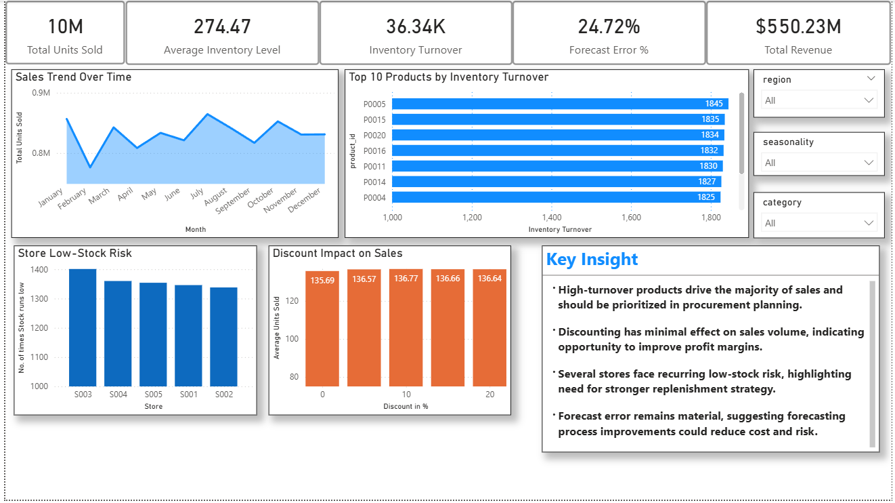

# Inventory Optimization & Demand Forecasting Analysis

## 📌 Project Overview
This project analyzes 73,000+ records of retail inventory and sales data to identify
operational inefficiencies, forecast accuracy issues, and opportunities for cost and
performance optimization using SQL and Power BI.

## 🛠 Tools Used
- SQL (MySQL)
- Power BI
- Excel

## 📊 Key Business Insights
- Identified top-performing products based on inventory turnover.
- Detected recurring low-stock risk across multiple stores.
- Found that discounting had minimal impact on sales volume.
- Highlighted material forecast error indicating need for improved planning.

## 📈 Dashboard Preview


## 📁 Repository Structure
- `data/` — Raw and cleaned datasets
- `sql/` — SQL queries and analysis
- `dashboard/` — Power BI dashboard file
- `images/` — Project visuals

## 🧾 Summary
This project demonstrates end-to-end data analysis including data extraction,
transformation, visualization, and business insight development.

## 🚀 How to Reproduce This Project

1. **Clone the repository**

  - git clone https://github.com/mihirpatel24/inventory-optimization-project.git


2. **Import the dataset**
   - Open MySQL  
   - Create the database and table structure  
   - Load the CSV file from the `data/` folder into the database  

3. **Run the SQL analysis**
   - Execute the queries in `sql/inventory_analysis.sql` to generate key insights and metrics  

4. **Open the Power BI dashboard**
   - Open `dashboard/inventory_optimization_dashboard.pbix` in Power BI Desktop  
   - Refresh the data connection to pull data from MySQL  

5. **Explore the insights**
   - Use the interactive filters to analyze results by **region**, **category**, and **seasonality**  
   - Review KPIs, trends, and risk indicators  ```
